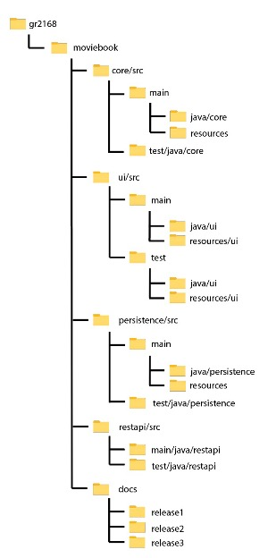

#  Moviebook 

The purpose of Moviebook is to allow an user to store their favorite movies to a library. Users can search up the movies which is directly connected to the [TMDB-database](https://www.themoviedb.org/) and retrieve information about the movie which includes title, genre and artcover. The user can also add their own unique review and rating to each movie before appending it to their library.

# Repository structure

### Modules and folders:
The project runs as a multi-modularized Maven project. Here are the modules and their functions:
- [core](moviebook/core):
    - Contains the core logic for the application
    - Consists of the package core
- [ui](moviebook/ui):
    - Module that pertains to the user interface
    - Contains controller- and app-classes, together with the corresponding FXML-file
- [persistence](moviebook/persistence):
    - Supplements persistence to the project and allows saving to a file
    - Uses the [Jackson library](https://github.com/FasterXML/jackson) to allow saving and reading from JSON-files
- [docs](moviebook/docs):
    - Contains documentation that is related to each delivery (release) of the project - 3 in total

## Folder illustration
An illustration of the repository structure which shows key folder and subfolder setup:

# Illustrations from the Application
Entering the application for the first time you will see the UI shown under. Your list of movies added is initially empty, and you are prompted to add a new one.

As the user starts typing in the movie title, the written string will be used to return a list of movies matching the string. If you want support for API for loading the movies poster and other information, you have to click the title on the list of returned movies.

After you've added a movie with support from TMDB, you will see the information loaded as shown under when you click on a movie in "Your movies". 

# User stories

User stories were generated during the developement cycle of the application and functionality was implemented following these:

- As a user I want to register a movie to the library
- As a user I want to be able to remove a movie from the library
- As a user I want to add a rating to the movie
- As a user I want to add a user review to the movie
- As a user I want to use a database that automatically retrieves information about the movie, saving me the hassle of adding redundant information manually
- As a user I want to sort movies both alphabetically and after the unique rating I gave them
- As a user, I want to view information about the movie by clicking on it. At the very least I want information about the genre and view the artwork.

# Project buildup

The project runs as a multi-modularized [Maven](https://maven.apache.org/) project;

- Core handles domain logic for the application
- UI generates and handles user a graphical user interface
- A REST-API module which handles remote storage to a server
- Persistence which allows the user to store their library on their storage. Uses the Jackson-library for generating and handling JSON-files.

The project is built using Java 16 and JavaFX 11.

